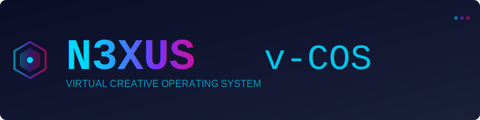
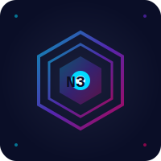
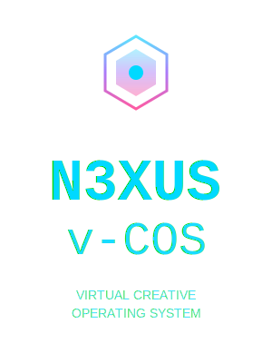

<div align="center">



# N3XUS v-COS

### Virtual Creative Operating System

[](LICENSE)
[]()
[]()

**The world's first Virtual Creative Operating System**

*Empowering creators with next-generation tools*

</div>

---

## 🎨 About the Logo

The **N3XUS v-COS** logo represents innovation, creativity, and technological advancement. It combines modern design elements with meaningful symbolism:

- **⬡ Hexagonal Geometry**: Symbolizes connectivity, structure, and the networking of creative ideas
- **🌈 Gradient Colors**: Represents the spectrum of creativity spanning from cyan to purple to magenta
- **✨ Glowing Effects**: Suggests digital energy and virtual presence
- **💻 Modern Typography**: Conveys technological advancement using Courier New monospace font

### Color Palette

<div align="center">

| Color | Hex | Usage |
|-------|-----|-------|
|  **Cyan** | `#00d9ff` | Primary accent, innovation |
|  **Purple** | `#7b2ff7` | Secondary accent, creativity |
|  **Magenta** | `#ff006e` | Tertiary accent, energy |
|  **Dark Navy** | `#0a0e27` | Primary background |

</div>

---

## 📦 Logo Variants

We provide multiple logo variants optimized for different use cases:

### 1. Primary Logo
<div align="center">


**Use for**: Headers, hero sections, main branding  
**File**: `logos/svg/n3xus-vcos-primary.svg`
</div>

### 2. Icon Logo
<div align="center">


**Use for**: App icons, favicons, avatars  
**File**: `logos/svg/n3xus-vcos-icon.svg`
</div>

### 3. Horizontal Logo
<div align="center">


**Use for**: Navigation bars, email signatures  
**File**: `logos/svg/n3xus-vcos-horizontal.svg`
</div>

### 4. Vertical Logo
<div align="center">


**Use for**: Mobile apps, vertical layouts  
**File**: `logos/svg/n3xus-vcos-vertical.svg`
</div>

---

## 🖥️ ASCII Art Versions

For terminal applications and CLI tools:

### Large ASCII Logo
```
███╗   ██╗██████╗ ██╗  ██╗██╗   ██╗███████╗    ██╗   ██╗      ██████╗ ██████╗ ███████╗
████╗  ██║╚════██╗╚██╗██╔╝██║   ██║██╔════╝    ██║   ██║     ██╔════╝██╔═══██╗██╔════╝
██╔██╗ ██║ █████╔╝ ╚███╔╝ ██║   ██║███████╗    ██║   ██║     ██║     ██║   ██║███████╗
██║╚██╗██║ ╚═══██╗ ██╔██╗ ██║   ██║╚════██║    ╚██╗ ██╔╝     ██║     ██║   ██║╚════██║
██║ ╚████║██████╔╝██╔╝ ██╗╚██████╔╝███████║     ╚████╔╝      ╚██████╗╚██████╔╝███████║
╚═╝  ╚═══╝╚═════╝ ╚═╝  ╚═╝ ╚═════╝ ╚══════╝      ╚═══╝        ╚═════╝ ╚═════╝ ╚══════╝
                                                                                        
           ╔══════════════════════════════════════════════════════════════╗
           ║      VIRTUAL CREATIVE OPERATING SYSTEM - THE FUTURE IS NOW   ║
           ╚══════════════════════════════════════════════════════════════╝
```

### Compact ASCII Logo
```
    ⬡  N3XUS v-COS  ⬡
    ═══════════════════
    Virtual Creative OS
```

---

## 📚 Documentation

### Brand Guidelines
Comprehensive guidelines for using the N3XUS v-COS logo and maintaining brand consistency:
- [**Brand Guidelines**](docs/BRAND_GUIDELINES.md) - Complete branding documentation
- [**Logo Assets Guide**](logos/README.md) - How to use logo variants

### Key Topics
- ✅ Logo philosophy and design elements
- 🎨 Color palette and usage
- 📐 Typography and fonts
- 📏 Clear space and minimum sizes
- ✓ Usage do's and don'ts
- 🖼️ File formats and specifications
- 💼 Social media guidelines
- 🖨️ Print and digital guidelines

---

## 🚀 Quick Start

### Using the Logo in Your Project

#### HTML
```html

```

#### Markdown
```markdown

```

#### Terminal
```bash
cat logos/ascii/logo-large.txt
```

---

## 📂 Repository Structure

```
N3XUS-vCOS/
├── logos/
│   ├── svg/                          # Vector graphics (recommended)
│   │   ├── n3xus-vcos-primary.svg
│   │   ├── n3xus-vcos-icon.svg
│   │   ├── n3xus-vcos-horizontal.svg
│   │   └── n3xus-vcos-vertical.svg
│   ├── png/                          # Raster graphics (coming soon)
│   ├── ascii/                        # ASCII art variants
│   │   ├── logo-large.txt
│   │   ├── logo-medium.txt
│   │   ├── logo-small.txt
│   │   └── logo-banner.txt
│   └── README.md                     # Logo usage guide
├── docs/
│   └── BRAND_GUIDELINES.md           # Comprehensive brand guidelines
└── README.md                         # This file
```

---

## 🎯 Design Principles

The N3XUS v-COS logo embodies these core principles:

1. **Innovation**: Cutting-edge design representing future technology
2. **Creativity**: Artistic elements celebrating creative expression
3. **Connectivity**: Hexagonal patterns symbolizing networked ideas
4. **Precision**: Clean lines and technical typography
5. **Energy**: Dynamic gradients and glowing effects

---

## 📋 Usage Guidelines

### ✓ DO
- Use official logo files from the `/logos` directory
- Maintain aspect ratios when scaling
- Use on backgrounds with sufficient contrast
- Apply appropriate clear space
- Use SVG format when possible

### ✗ DON'T
- Stretch or distort the logo
- Change logo colors
- Add unauthorized effects
- Place on busy backgrounds
- Rotate at odd angles

---

## 🤝 Contributing

We welcome contributions to enhance the N3XUS v-COS brand! If you have suggestions for:
- New logo variants
- Additional color schemes
- Updated documentation
- Bug fixes or improvements

Please open an issue or submit a pull request.

---

## 📄 License

This project is licensed under the MIT License - see the [LICENSE](LICENSE) file for details.

---

## 🔗 Links

- **Repository**: [github.com/BobbyBlanco400/N3XUS-vCOS](https://github.com/BobbyBlanco400/N3XUS-vCOS)
- **Issues**: [Report issues or request features](https://github.com/BobbyBlanco400/N3XUS-vCOS/issues)

---

<div align="center">

### ⬡ N3XUS v-COS ⬡
**Virtual Creative Operating System**

*The Future of Creative Computing*

Made with 💜 by the N3XUS team

</div>
